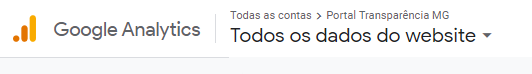
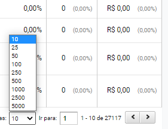
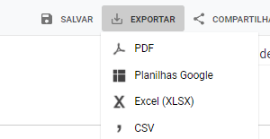
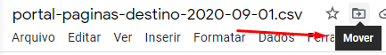

# Referência sobre a criação deste app

Referências sobre a criação deste app, incluindo versões Ruby e Rails estão disponíveis no arquivo [especificacoes_ruby_on_rails.md](/especificacoes_ruby_on_rails.md)

# Automatização Classificações de Acesso Portal da Transparência MG

## Exportação arquivo Google Analytics

1. Acessar [Google Analytics](https://analytics.google.com/) (necessário já estar com acesso. liberado a informações do [Portal da Transparência](http://www.transparencia.mg.gov.br/)).

2. Na barra de opções superior selecionar o site desejado (ckan ou portal da transparência) e clique em 'Todos os dados do website'.


3. No menu lateral esquerdo acesse:     
   Comportamento > Conteúdo do Site > Página de Destino.

4. Selecione o período desejado na aba lateral direita  e clique em "Aplicar".

5. No final da página selecione a opção para exibir 5.000 linhas por vez:

    * Observe o número de registros do relatório para prever o número de exportações necessárias;
    * São gerados, em média 25.000 registros mês para o PORTAL, exigindo, portanto a exportação do relatório aproximadamente 5 vezes. No Ckan são gerados menos de 1.000 registros durante elaboração deste tutorial.

    

6. Volte para o início da página e clique na opção Exportar > Planilha Google.

  

  7. A depender da instância trabalhada no momento, renomeie o arquivo exportado no padrão "portal-paginas-destino-AAAA-MM-VERSAO.csv" ou "ckan-paginas-destino-AAAA-MM-VERSAO", exemplo:
      * Primeiro relatório do ckan de Março de 2021: ckan-paginas-destino-2021-03-01.csv;
      * Quinto relatório do portal de Janeiro de 2020: portal-paginas-destino-2020-01-05.csv;
      * Segundo relatório do portal de Novembro de 2021: portal-paginas-destino-2021-11-02.csv.


  ***Observações IMPORTANTES:***
  * Caso padrão do nome não seja seguido corretamente a classificação poderá não ocorrer corretamente

  * geralmente o CKAN não passa de um relatório, atualmente, entretanto, pode vir a ter mais de uma planilha de 5 mil linhas, assim como o Portal, a depender do aumento do número de acessos mensais

  8. Mova o arquivo exportado para pasta Google Drive correta da DTA:
     *  [Portal_Transparencia_Indicadores do Portal](https://drive.google.com/drive/folders/15KuJy3qSzsi9fVAsxrnCmlr_TNUR6iyG?usp=sharing). Observe a necessidade de criação de subpastas ano/mês para armazenamento correto do arquivo.

     

  9. Faça o passo 5 a 8 até finalizar a exportação do dados para planilha google.

## Exportação arquivo .csv a partir do Google Sheets

1. Apagar todas as linhas superiores incluindo a linha de cabeçalho (primeira linha deverá ser a correspondente ao primeiro registro).
     **DEIXAR APENAS A PRIMEIRA PLANILHA COM CABEÇALHO**

2. Apagar todas as linhas inferiores desde a linha do último registro (totais).

3. **na hipótese de exportar para csv direto na máquina (CUIDADO!!)**: Verificar se há separadores de colunas (vírgula ou ponto-e-vírgula) como caracteres nos valores da coluna da URL (ex.: ``/dataset?q=&tags=coronavirus&sort=score+desc,+metadata_modified+desc``); após corrigir esse escaping,

4. Apagar as 3 colunas mais à direita (**não faça esse item sem ter checado o anterior**). A última coluna remanescente à direita deverá ser 'Duração média da sessão', ou seja, coluna G (formato hh:mm:ss).

5. Exportar o resultado deste trabalho em um arquivo .csv, tal qual mostrado na figura abaixo (arquivo > fazer download > csv):


    - Nome do arquivo exportado **NÃO** deverá ser modificado;
    - Vírgula (",") deverá ser o caracter de separação de colunas do arquivo exportado, caso contrário classificação automática descrita abaixo irá apresentar erro. Google sheets já faz a exportação com este padrão, mas vale conferir (vide itens 5 e 6).

## Realização classificação automática

1. Acesse [PORTAL DA TRANSPARÊNCIA - GOOGLE ANALYTICS](https://transparencia-google-analytics.herokuapp.com/users/sign_in)
  * Caso não possua login e senha solicitar via e-mail para gabriel.dornas@cge.mg.gov.br


2. No menu lateral esquerdo selecione: Links Úteis > Arquivo Google Analytics

      * Ao clicar uma nova aba será aberta com a url - https://transparencia-google-analytics.herokuapp.com/importations/new
      * Caso alguma mensagem de erro ocorra copie e cole a url acima.


3. Selecione o arquivo .csv gerado na etapa acima clicando no botão "Choose File" ou "Escolher arquivo".

4. Com arquivo selecionado e clique no botão "Importar Arquivos".

5. Um novo arquivo .csv será exportado via Browser COM A CLASSIFICAÇÃO REALIZADA.
  * Entre a importação e classificação de um arquivo para outro é necessário atualizar a página.

## Unificação dos arquivos, ajustes, validação e publicação

1. Ao final da classificação de todos os arquivos da propriedade PORTAL, salvá-los numa pasta transitória de nome `raw/` no repositório https://github.com/dados-mg/google-analytics e unificá-los em uma única planilha da forma como segue:

* **modo provisório**: utilizar o comando `$ awk '(NR == 1) || (FNR > 0)' *.csv > portal-paginas-destino-AAAA-MM.csv` na `bash` da pasta onde estiverem salvos os arquivos csv (para este comando funcionar, a pasta deve conter somente os arquivos referentes à propriedade PORTAL, e pelo menos um deles deve conter o cabeçalho `propriedade;mes;pagina_destino;URL;sessoes;novas_sessoes_porcentagem;usuarios_novos;taxa_rejeicao;paginas_sessao;duracao_sessao

* **modo a ser implementado**:

    * na bash aberta na raiz do repositório https://github.com/dados-mg/google-analytics, digitar `make unify_resource`
    * para este comando funcionar, a pasta deve conter somente os arquivos referentes à propriedade PORTAL, e pelo menos um deles deve conter o cabeçalho 
    
    `propriedade;mes;pagina_destino;URL;sessoes;novas_sessoes_porcentagem;usuarios_novos;taxa_rejeicao;paginas_sessao;duracao_sessao`

    * Padrão da nomenclatura:

         - propriedade PORTAL: "portal-paginas-destino-AAAA-MM.csv";
         - propriedade CKAN: "ckan-paginas-destino-AAAA-MM.csv";
         

- É interessante observar para o arquivo unificado o percentual de codificação de-para igual a "Outros" em relação ao total classificado. Um percentual grande (>10%) pode indicar a necessidade do aprimoramento do castro De-para (descrito abaixo)
  
2. Fazer o `pull` do repositório https://github.com/dados-mg/google-analytics

3. Fazer a inclusão do novo recurso no arquivo [datapackage.json](https://github.com/dados-mg/google-analytics/blob/master/datapackage.json)

4. Seguir as orientações do arquivo [README.md](https://github.com/dados-mg/google-analytics/blob/master/README.md) para validar o novo arquivo incluído, juntamente com o datapackage revisado

```
$ frictionless validate datapackage.json
```

5. Realizar o push com as atualizações do conjunto para o [github](https://github.com/dados-mg/google-analytics) seguindo [fluxo de trabalho em repositórios github](https://github.com/transparencia-mg/handbook/blob/master/fluxo-trabalho-github.md)


## Aprimorando o cadastro De-para

1. Acesse [PORTAL DA TRANSPARÊNCIA - GOOGLE ANALYTICS](https://transparencia-google-analytics.herokuapp.com/users/sign_in)
  * Caso não possua login e senha solicitar via e-mail para gabriel.dornas@cge.mg.gov.br
2. No menu lateral esquerdo selecione Navegação>Classificação de URLs
3. Selecione a opção "Criar Novo" e inclua a URL e sua classificação no formulário. Não esqueça de selecionar o botão "Gravar"
  * Não incluir a barra "/" no início do cadastro da url
